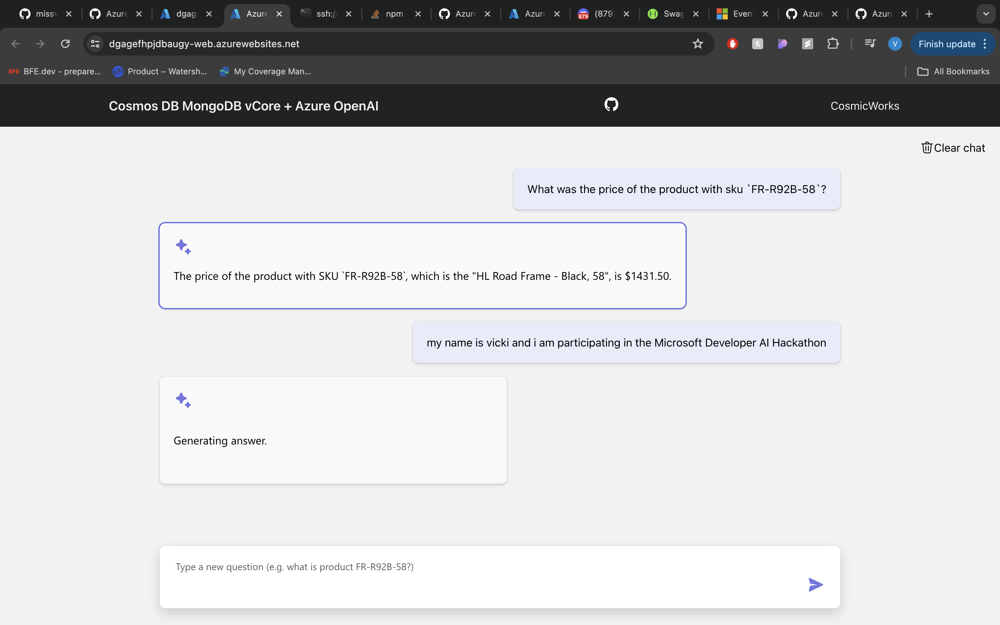

# azure-ai-copilot
This is part of phase 1 of the microsoft AI hackation. A custom co-pilot using microsoft azure open ai and cosmos DB. This code includes loading product data and creating embeddings to implement vector search. Openai and langchain are then used to create dialogue for the backend API (hosted in azure). The frontend of this application is deployed from a .bicep file following the developers guide from the hackathon.

